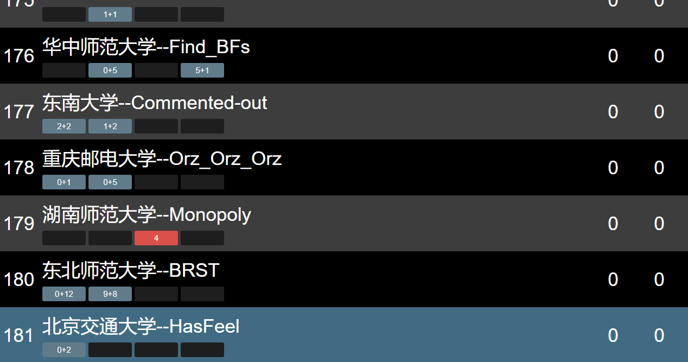
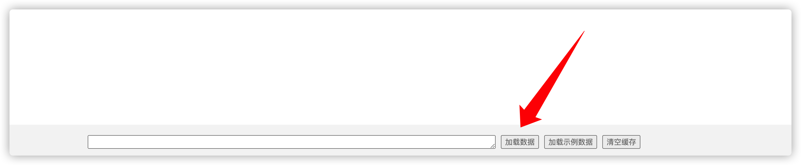

# xaut-acm-resolver

XAUT OJ 滚榜工具，地址：http://10.50.40.9:8080

## Screenshot



### Load Data



从XAUT OJ比赛成绩表中导出 ghost 文件后，将其内容粘贴在输入框中，然后点击「加载数据」。

### Operation

按空格下拉。

不停按方向键右即可。

### DOMjudge

可以使用 [XCPCIO/domjudge-utility](https://github.com/XCPCIO/domjudge-utility/tree/main/cmd/dump) 将 DOMjudge 中的数据导出成 acm-resolver 所需要的数据格式。

dump 的配置参考：

```yaml
base_url: "https://localhost/domjudge/"
userpwd: "username:password"

cid: 1
saved_dir: "./output/1"

exported_data:
  resolver_data: true
```

然后参考 [Load Data](#Load-Data) 将数据加载进去。

## JSON Configuration Format

```json
{
    "contest_name": "your contest name",
    "problem_count": 13,
    "frozen_seconds": 3600,
    "solutions": {},
    "users": {}
}
```

`solution` 的格式，key 可以任意，problem 下标从 1 开始:

```json
{
    "381503": {
        "user_id": "1",
        "problem_index": "1",
        "verdict": "AC",
        "submitted_seconds": 22
    },
    "381504": {
        "user_id": "2",
        "problem_index": "1",
        "verdict": "WA",
        "submitted_seconds": 23
    }
}
```

`user` 的格式，其中 key 即为 user 的 id，要和 solution 中对上：

```json
{
    "1": {
        "name": "花落人亡两不知",
        "college": "HZNU",
        "is_exclude": true
    },
    "2": {
        "name": "大斌丶凸(♯｀∧´)凸",
        "college": "HDU",
        "is_exclude": false
    },
    "3": {
        "name": "天才少女队",
        "college": "PKU",
        "is_exclude": true
    }
}
```
